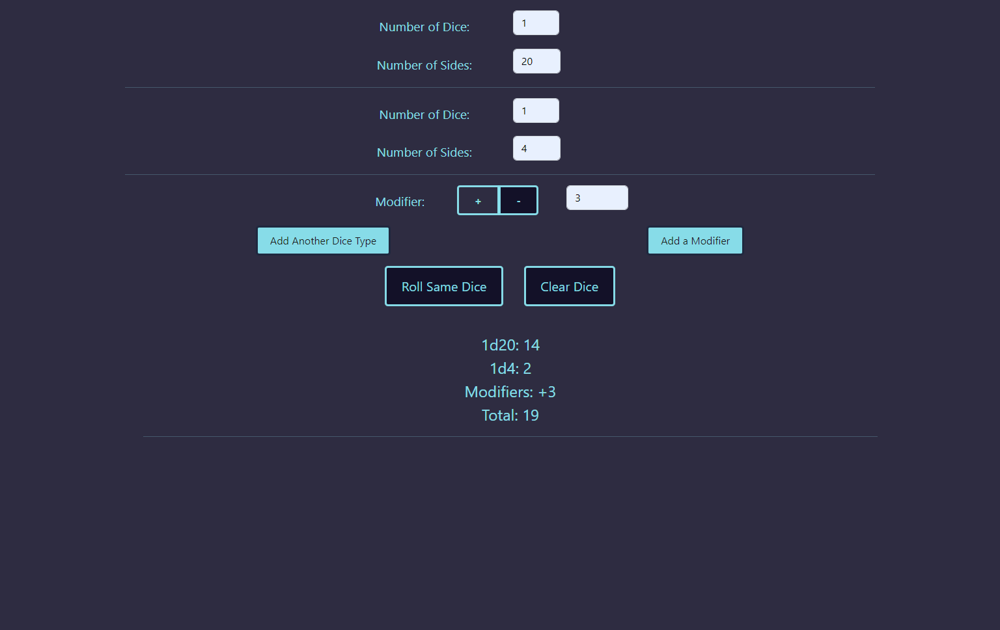

# roll-of-the-dice

## Description

Roll of the Dice is an online dice roller made using JavaScript, HTML, CSS, and Bootstrap. The user can roll any number of dice with any number of sides. Modifiers and additional dice can be added in the same roll. Results of the individual dice are displayed and tallied for convenience. I designed it with D&D in mind, but it can be used for other dice-based games, or for other dice-rolling purposes.

## Installation

N/A

## Usage

- Enter the number of dice and the number of sides on the dice
- Select Add a Modifier to add (or subtract) a number to your result (Up to 10 modifiers may be added per roll)
- Select Add Another Dice Type to roll additional dice (Up to 10 additional types of dice may be added per roll)
- Hit Roll to roll the dice and get your result
- Select Roll Same Dice to roll again (previous results will stay visible)
- Select Clear Dice to reset the dice options and result display

Here is a screenshot of the application:

Here is the link to the deployed application: [https://annhixson.github.io/roll-of-the-dice/](https://annhixson.github.io/roll-of-the-dice/)

## Credits

N/A

## License

None
